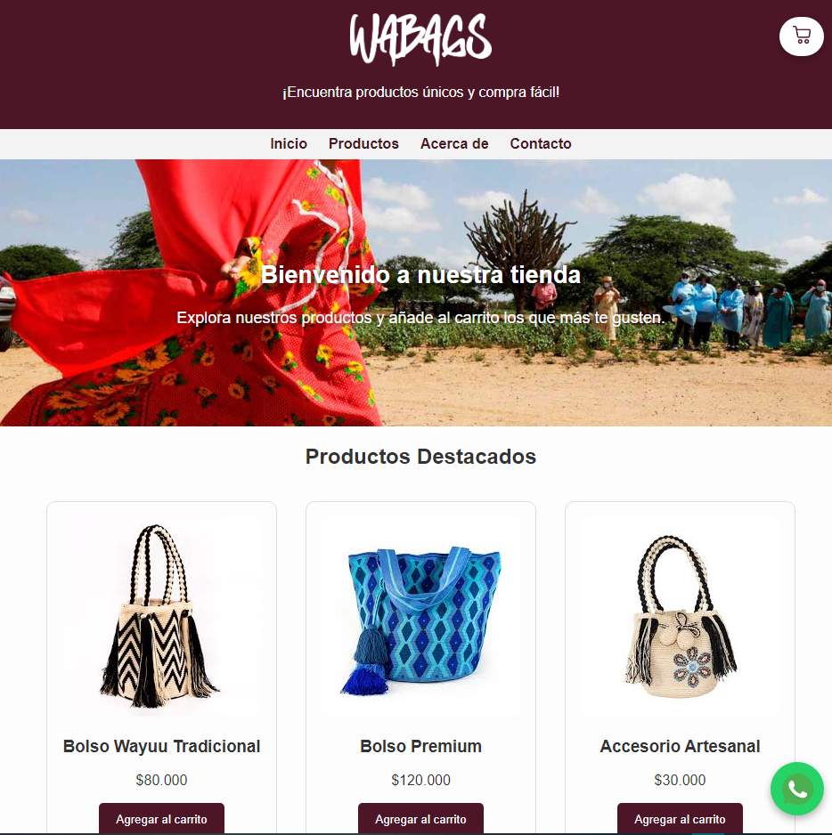
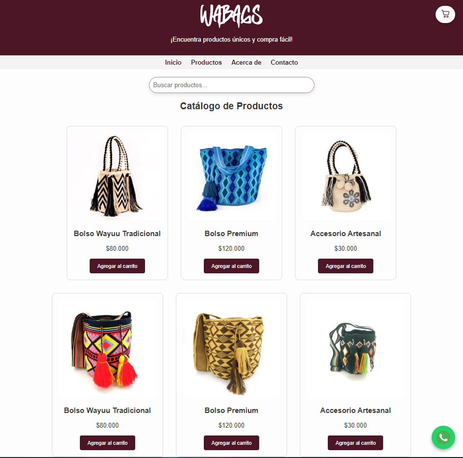
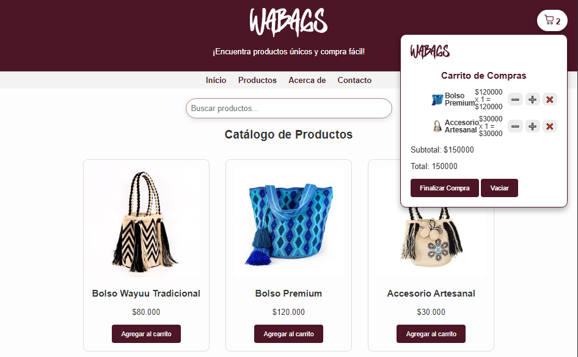
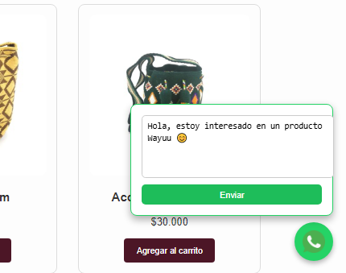

# 👜 WABAGS E-commerce

**WABAGS** es una tienda virtual diseñada para la venta de productos artesanales Wayuu, permitiendo a los usuarios descubrir productos únicos y contactar fácilmente con el vendedor vía WhatsApp.

🔗 **Sitio Web:** [https://everson28.github.io/wabags/](https://everson28.github.io/wabags/)

---

## 🎯 Objetivo

Crear una tienda web funcional que facilite la visualización de productos artesanales, permita añadirlos al carrito de compras, y finalice el pedido directamente por WhatsApp.

---

## 🧰 Tecnologías utilizadas

- HTML5  
- CSS3  
- JavaScript (Vanilla JS)  
- Git y GitHub  
- GitHub Pages para publicación  

---

## 🖼️ Capturas de pantalla

### 🏠 Página de inicio

Captura de la portada de la tienda:

---

### 🛍️ Catálogo de productos

Captura mostrando los productos disponibles:

---

### 🛒 Carrito de compras flotante

Captura del carrito que aparece al añadir productos:

---

### 💬 Finalizar compra por WhatsApp

Captura del botón de WhatsApp que se usa para finalizar la compra:

---

## 🗂️ Estructura del proyecto

Wabags E-commerce/
├─ index.html
├─ productos.html
├─ style.css
├─ funcion.js
├─ image/
│ └─ (Imágenes de productos y logos)
├─ captures/
│ ├─ inicio.png
│ ├─ productos.png
│ ├─ carrito.png
│ └─ whatsapp.png
└─ README.md

Autor
Desarrollado por Everson De Armas
📧 dearmas1128@gmail.com
📱 Instagram: @de_armas28

Proyecto cultural
Esta tienda busca difundir la cultura Wayuu y facilitar el comercio justo de productos artesanales hechos a mano por la comunidad.

🧪 Estado del proyecto
✅ Versión inicial publicada
🚀 Funcional y activa
🔧 En mejora constante

📝 Licencia
Este proyecto puede ser reutilizado para fines educativos o culturales. Atribución requerida.